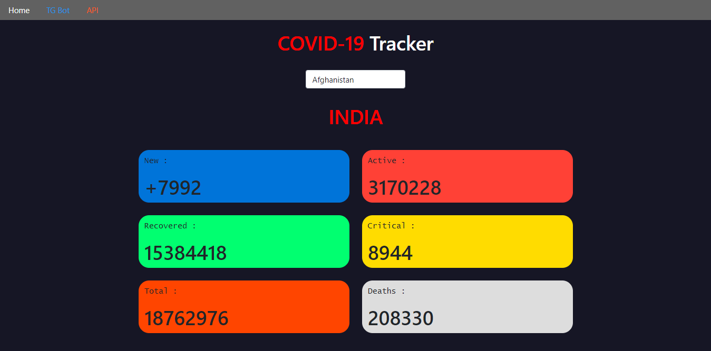
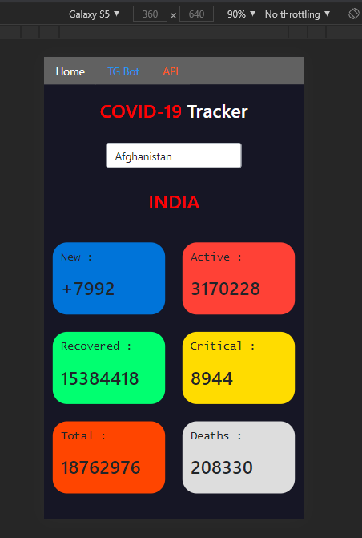

# Covid Tracker
## Simple tool to track Covid-19 cases in all countries
**It helps you to track**
> 1. New cases
> 2. Total active cases
> 3. Recovered cases 
> 4. Critical Cases
> 5. Total Cases
> 6. Total Deaths
<br>
<hr>
<br>

## How to run
- Add rapid api key in views.py file and SECRET_KEY in setting.py file, then open project in virtual environment and run the following commands

```
pip install -r requirements.txt
```

<br>

- Then  Run
<br>
```
python manage.py runserver
```

<br>
<hr>
<br>

## How will it look
<br>


<br>
<hr>
<br>

